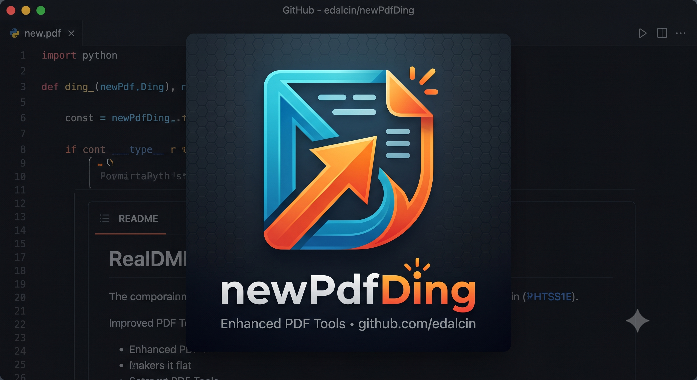

# newPdfDing

<p align="center"></p>

**Sua biblioteca de PDFs, do jeito que trabalho de verdade funciona.**

Advogado com jurisprudência e contratos, engenheiro com manuais técnicos e datasheets, chef com receitas escaneadas, pesquisador com artigos científicos — todo mundo que lida com PDF em volume conhece o problema: dezenas de pastas, nomes de arquivo sem sentido, um documento perdido que você *sabe* que tem mas não lembra onde guardou. newPdfDing é uma biblioteca self-hosted, single-user, que organiza, indexa e — principalmente — **encontra** seus PDFs por você, mesmo quando você não lembra a palavra exata que procura.

Sem assinatura, sem SaaS, sem seus documentos saindo do seu servidor. Um binário único em Go, SQLite embutido, frontend SvelteKit no mesmo processo — sobe em segundos, roda em qualquer VPS barata ou num Raspberry Pi na estante.

## Busca semântica

A caixa de busca da biblioteca não é só léxica: quando `GEMINI_API_KEY` está configurada, ela também busca por **significado**, não só por palavra exata. É a diferença entre vasculhar título por título, esperando lembrar o nome exato do arquivo, e simplesmente lembrar do que ele tratava.

### Por que isso importa no seu dia a dia

Cada profissão tem seu próprio vocabulário instável — sinônimos, jargão técnico, termos que mudam de autor para autor ou de época para época. A busca léxica exige a palavra exata; a busca semântica entende o conceito por trás dela:

- No escritório de advocacia, buscar **"cláusula de rescisão"** encontra um contrato cujo texto só fala em *"extinção antecipada do vínculo contratual"* — redação diferente, mesma cláusula.
- Na engenharia, buscar **"superaquecimento do motor"** traz o manual técnico que descreve *"falha térmica por sobrecarga"*, mesmo sem usar as palavras exatas.
- Na cozinha, buscar **"sobremesa sem glúten"** recupera receitas escaneadas cujo título é só o nome do prato, porque a busca entende o conteúdo, não a etiqueta.
- No mundo acadêmico, buscar por um **termo técnico antigo** ainda encontra o artigo publicado sob nomenclatura atualizada, porque a busca captura o significado do conteúdo, não a grafia exata.

Na prática: sua biblioteca de PDFs — contratos, manuais, receitas, artigos, relatórios, o que for — vira pesquisável por **conceito**, não só por título e palavra-chave, sem depender de você lembrar exatamente como cada documento foi escrito.

### Como funciona

Funciona assim:

1. Cada PDF tem um botão **"Embedar"** — sob demanda, um documento por vez, nunca automático (sem worker, sem fila, sem custo de API além do que você aciona explicitamente).
2. Ao clicar, o servidor extrai nome + descrição + início do texto do PDF e chama a API Gemini (`batchEmbedContents`) uma única vez, guardando o vetor resultante (3072 dimensões) em SQLite.
3. A partir daí, toda busca na biblioteca funde dois candidatos — o rank léxico do FTS5 e o rank semântico por similaridade de cosseno — via **Reciprocal Rank Fusion (RRF)** numa caixa única. Não há seletor de "modo léxico vs. semântico": é sempre os dois, fundidos.
4. Documentos ainda não embedados continuam aparecendo normalmente nos resultados léxicos — a busca nunca fica pior por não ter embedding, só melhor com ele.
5. Editar nome, descrição ou o texto do PDF marca o embedding como `stale` (desatualizado) até você reembedar — a interface avisa com o rótulo "Reembedar".

**PDFs importados de uma instância antiga (banco Django legado) ou trazidos pela watch-dir chegam sem texto extraído.** Para esses, o visualizador extrai o texto automaticamente na primeira vez que você abre o PDF (mesmo pdf.js do upload, rodando no navegador) e envia de volta ao servidor — depois disso o documento já pode ser embedado normalmente, sem precisar re-enviar o arquivo.

Sem `GEMINI_API_KEY` configurada, nada disso quebra: o botão "Embedar" aparece desabilitado com um aviso, e a busca cai de volta para puramente léxica (FTS5 + fallback `LIKE`). Ver a mecânica completa — fórmula do texto embedado, fusão RRF, custo, tetos de escala — em [`refatoracao/04-busca-hibrida.md`](refatoracao/04-busca-hibrida.md).

## Metadados com IA

Com `GEMINI_API_KEY` configurada, a página de detalhes de cada PDF ganha dois atalhos que reaproveitam o texto já extraído do documento (o mesmo usado pela busca):

- **Descrever com IA**: gera um parágrafo de até 60 palavras a partir do conteúdo e preenche/salva o campo Descrição — útil para os PDFs escaneados/importados que chegam sem descrição nenhuma.
- **Sugerir tags**: lê o mesmo texto e sugere, como chips clicáveis, apenas tags que **já existem** no seu acervo — nunca inventa uma tag nova; um clique aplica a sugestão.

O modelo usado em cada atalho — e o modelo de embedding da busca semântica acima — é escolhido em **Configurações → IA**, numa lista alimentada em tempo real pela `models.list` da própria chave configurada, sem modelo fixo no código. Sem `GEMINI_API_KEY`, os dois botões continuam visíveis mas respondem com uma mensagem clara pedindo a chave, em vez de falhar em silêncio.

## Funcionalidades

- **Biblioteca**: 4 layouts (grade/lista/compacto/mínimo), 7 ordenações, rolagem infinita, upload individual e em lote com processamento no navegador (thumbnail, preview e texto via pdf.js) — nada de fila de processamento no servidor, o PDF já entra pronto para busca.
- **Busca híbrida**: caixa única na biblioteca, léxica sempre ativa, semântica quando configurada (ver acima) — pesquise por conceito, não só por título exato.
- **Metadados com IA**: descrição e sugestão de tags geradas sob demanda a partir do texto do PDF via Gemini (ver acima) — sem custo de API além do que você aciona explicitamente.
- **Tags**: autocompletar com sugestão das tags existentes e criação de tag nova inline, direto na página de detalhes do PDF; lista de tags clicável na biblioteca para filtrar por tag; administração (renomear/excluir/fundir) em `/tags` — organize contratos, manuais e receitas do seu jeito, sem taxonomia imposta.
- **Coleções**: organização em coleções, com contagem de PDFs por coleção; coleção padrão protegida contra exclusão — separe clientes, projetos ou assuntos.
- **Anotações**: comentários e destaques por página, com exportação em YAML/JSON — grife o que importa e leve as anotações para fora, sem lock-in.
- **Compartilhamento público**: link sem senha/expiração, com contador de visualizações, revogável a qualquer momento — mande um documento pra alguém sem depender de e-mail com anexo de 40MB.
- **Watch-dir opcional**: deixa cair PDFs numa pasta observada e eles entram sozinhos no acervo, com tags padrão configuráveis — sincronize com a pasta que você já usa hoje.

## Rodando com Docker (recomendado)

```bash
docker run -d \
  --name newpdfding \
  --read-only \
  --cap-drop=ALL \
  -p 8000:8000 \
  -e ADMIN_PASSWORD=change-me \
  -e DB_PATH=/data/newpdfding.db \
  -e FILES=/files \
  -v newpdfding-data:/data \
  -v newpdfding-files:/files \
  ghcr.io/edalcin/newpdfding:latest
```

`--read-only --cap-drop=ALL` é a execução recomendada (ver [`refatoracao/08-seguranca.md`](refatoracao/08-seguranca.md#menor-privilégio)): a imagem é distroless e não escreve em lugar nenhum além dos volumes `/data` e `/files` montados acima, então travar o resto do filesystem como somente-leitura e derrubar todas as capabilities Linux não quebra nada.

Acesse `http://localhost:8000` e entre com a senha definida em `ADMIN_PASSWORD`.

### Habilitando a busca semântica

Some uma variável ao `docker run` acima (ou ao seu `.env`/template do Unraid):

```bash
-e GEMINI_API_KEY=sua-chave-aqui
```

Chave gratuita (com cota diária) em [aistudio.google.com/apikey](https://aistudio.google.com/apikey). Sem ela, tudo funciona normalmente — só a busca fica puramente léxica.

### Docker Compose

```bash
cp .env.example .env   # preencher ADMIN_PASSWORD, GEMINI_API_KEY (opcional) e ajustar o resto
docker compose up --build
```

### Unraid

Guia dedicado com os campos exatos de **Docker → Add Container**: [`UNRAID.md`](UNRAID.md).

## Variáveis de ambiente

Lista fechada — nenhuma variável fora dela é lida pelo binário. Ver [`.env.example`](.env.example) para os placeholders e [`refatoracao/07-docker-ci-deploy.md`](refatoracao/07-docker-ci-deploy.md#variáveis-de-ambiente) para a tabela completa (obrigatória/default/significado).

| Variável | Obrigatória | Default |
|---|---|---|
| `ADMIN_PASSWORD` | Sim | — |
| `DB_PATH` | Sim | — |
| `FILES` | Sim | — |
| `LISTEN_ADDR` | Não | `:8000` |
| `BASE_URL` | Não | derivado da requisição |
| `SESSION_IDLE_MINUTES` | Não | `43200` |
| `MAX_UPLOAD_MB` | Não | `200` |
| `TRUST_PROXY_HEADERS` | Não | `false` |
| `LOG_LEVEL` | Não | `info` |
| `GEMINI_API_KEY` | Não | *(vazio — desliga a busca semântica)* |
| `EMBED_MODEL` | Não | `models/gemini-embedding-001` |
| `CONSUME_ENABLE` | Não | `false` |
| `CONSUME_DIR` | Não | `<FILES>/consume` |
| `CONSUME_INTERVAL_MINUTES` | Não | `5` |
| `CONSUME_TAGS` | Não | `""` |
| `CONSUME_SKIP_EXISTING` | Não | `true` |

`EMBED_MODEL` e o modelo de texto usado por "Descrever com IA"/"Sugerir tags" também podem ser escolhidos em **Configurações → IA**, numa lista populada pela sua própria chave — a variável de ambiente vira só o default de embedding, nunca obrigatória além de existir a chave.

## Desenvolvimento

Requer Go 1.25+ e Node 22+.

```bash
# Backend
go build ./cmd/newpdfding
go test ./...

# Frontend (gera frontend/build, embutido via go:embed em internal/server/web/dist)
cd frontend
npm ci
npm run build
```

Servidor local:

```bash
export ADMIN_PASSWORD=dev DB_PATH=./dev.db FILES=./dev-files
go run ./cmd/newpdfding
```

## Migrando de uma instância Django antiga

Existe um comando único de importação para trazer dados de uma instância legada (Django) para o schema novo — coleções, tags, PDFs, anotações e compartilhamentos, preservando contadores e datas originais. Nenhum PDF importado é embedado automaticamente (`pdf_embeddings` fica vazio até você clicar "Embedar" ou abrir o documento no visualizador, que faz o backfill de texto necessário):

```bash
docker run --rm \
  -e ADMIN_PASSWORD='...' -e DB_PATH=/data/newpdfding.db -e FILES=/files \
  -v <pasta-nova>/db:/data -v <pasta-nova>/files:/files \
  -v <pasta-do-banco-antigo>:/legacy-db:ro -v <pasta-de-mídia-antiga>:/legacy-media:ro \
  ghcr.io/edalcin/newpdfding:latest \
  -import-legacy /legacy-db/db.sqlite3 /legacy-media
```

Detalhes completos, incluindo permissões de volume e um passo a passo para Unraid, em [`refatoracao/instrucoesFinais.md`](refatoracao/instrucoesFinais.md).

## Arquitetura

Binário único: Go (chi, SQLite puro-Go, FTS5) servindo uma API REST e a SPA SvelteKit embutida via `go:embed`. Busca híbrida (FTS5 + embeddings Gemini sob demanda, fusão RRF), sem worker nem automação de embedding. Detalhes completos do plano de refatoração e da arquitetura alvo: [`refatoracao/`](refatoracao/README.md).

## Atribuição

Este projeto é derivado de **[PdfDing](https://github.com/mrmn2/PdfDing)** por [mrmn2](https://github.com/mrmn2), licenciado sob AGPL-3.0 — ver [`LICENSE`](./LICENSE).
